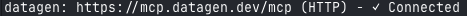

# Quick Start Guide

Get from clone to deployed in **5 minutes**.

## Prerequisites

- Python 3.13+
- Anthropic API key ([Get one here](https://console.anthropic.com/settings/keys))
- Claude Code (desktop) with Claude Code enabled:  
  ```bash
  curl -fsSL https://claude.ai/install.sh | bash
  ```
- Railway CLI for deployment ([Installation guide](https://docs.railway.com/guides/cli))
- DataGen API key (for the poem email drafter example): Get `DATAGEN_API_KEY` at https://datagen.dev/account?tab=api

## Step 1: Clone and Setup

```bash
# Clone the repository
git clone https://github.com/datagendev/agent-fastapi-boilerplate my-agent-project
cd my-agent-project

# Create environment file
cp .env.example .env
```

**Edit `.env` and add your API keys:**

```bash
ANTHROPIC_API_KEY=sk-ant-api03-your-key-here
DATAGEN_API_KEY=your-datagen-key  # Get from https://datagen.dev/account?tab=api
AGENT_NAME=poem-email-drafter
```

## Step 2: Setup DataGen MCP Gateway

Add the DataGen MCP gateway in Claude Code (must be in project directory):

```bash
# Make sure you're in the project directory
cd my-agent-project

# Add DataGen MCP gateway (uses DATAGEN_API_KEY from environment)
export DATAGEN_API_KEY=your-datagen-key  # Use your actual key
claude mcp add --transport http datagen https://mcp.datagen.dev/mcp --header "x-api-key: $DATAGEN_API_KEY"
```

Verify installation:
```bash
claude mcp list
```
You should see the DataGen gateway listed.



## Step 3: Add Gmail MCP to DataGen Gateway

DataGen MCP is a gateway that allows you to add multiple MCP servers (like Gmail). To use the email drafter, add Gmail MCP through the DataGen dashboard:

1. Go to [DataGen MCP Servers](https://datagen.dev/account?tab=mcp).
2. Find "Gmail" in the list of available integrations.
3. Click "Connect" and follow the authorization flow.

> **Note:** This adds Gmail MCP to your DataGen gateway, allowing the agent to perform actions (like creating drafts) on your behalf.

## Step 4: Add the Poem Email Drafter Agent

```bash
cp examples/poem-email-drafter/agent.md .claude/agents/poem-email-drafter.md
```

**Verify DataGen MCP in Claude Code:**

Open Claude Code and ask:
`List Gmail tools from the Datagen MCP`

Expected: Claude lists DataGen MCP Gmail tools like `mcp_Gmail_gmail_create_draft`.

## Step 5: Verify Agent in Claude Code

Open Claude Code and run a quick sanity check:

```Using the poem-email-drafter subagent, draft a poem about New York and create the Gmail draft.```

Expected: Claude uses DataGen MCP Gmail tools and produces a draft without errors.

## Step 6: Test Locally

```bash
# Create and activate virtual environment (recommended)
python -m venv venv
source venv/bin/activate  # On Windows: venv\Scripts\activate

# Install dependencies
pip install -r requirements.txt

# Run tests
./scripts/test-local.sh
```

You should see:
```
✓ Health check passed
✓ Agent metadata retrieved
✓ Agent execution queued
✅ All tests passed!
```

## Step 7: Deploy to Railway 

### Install Railway CLI

Choose one installation method ([See all options](https://docs.railway.com/guides/cli)):

```bash
# Homebrew (macOS)
brew install railway

# npm (all platforms - requires Node.js)
npm i -g @railway/cli

# Shell script (macOS, Linux, WSL)
bash <(curl -fsSL cli.new)
```

### Deploy

```bash
./scripts/deploy.sh
```

The interactive script will:
1. Check prerequisites (Railway CLI installed)
2. Create/link Railway project
3. Upload environment variables from `.env`
4. Deploy your agent

## Step 8: Test Your Deployed Agent

```bash
# Get your deployment URL
URL=$(railway domain)

# Test the health endpoint
curl $URL/health

# Test agent execution
curl -X POST $URL/run \
  -H "Content-Type: application/json" \
  -d '{"payload": {"text": "Hello, deployed agent!"}}'
```

## That's It! 🎉

Your agent is now deployed and ready to use.

> 📘 **Need more help?** See [RAILWAY_DEPLOY.md](RAILWAY_DEPLOY.md) for detailed Railway deployment guide, troubleshooting, and advanced usage.

## Next Steps

### Monitor Your Agent

```bash
# View logs
railway logs --follow

# Open Railway dashboard
railway open
```

### Customize Your Agent

1. Edit your agent file: `.claude/agents/your-agent.md`
2. Test locally: `./scripts/test-local.sh`
3. Redeploy: `./scripts/deploy.sh`

### Add Webhook Security

Update `.env`:
```bash
WEBHOOK_SECRET=your-random-secret-key
```

Generate a secure secret:
```bash
openssl rand -hex 32
```

Then redeploy:
```bash
./scripts/deploy.sh
```

Now all requests to `/run` must include the header:
```bash
-H "X-API-Key: your-random-secret-key"
```

### Use a Different Model

Update `.env`:
```bash
MODEL_NAME=claude-opus-4-5
```

Available models:
- `claude-sonnet-4-5` (default, balanced)
- `claude-opus-4-5` (most capable)
- `claude-haiku-4` (fastest, cheapest)

## Troubleshooting

### "ANTHROPIC_API_KEY is required"

Make sure you've added your API key to `.env`:
```bash
ANTHROPIC_API_KEY=sk-ant-api03-...
```

### "Agent file not found"

Check that your agent file exists:
```bash
ls .claude/agents/
```

Make sure `AGENT_NAME` in `.env` matches the filename (without `.md`):
```bash
AGENT_NAME=my-agent  # Loads .claude/agents/my-agent.md
```

### "Railway CLI not found"

Install Railway CLI:
```bash
npm i -g @railway/cli
```

Or visit: https://docs.railway.app/develop/cli

### Tests fail locally

1. Check `.env` has valid `ANTHROPIC_API_KEY`
2. Ensure Python dependencies are installed: `pip install -r requirements.txt`
3. Check logs for specific errors

## Common Use Cases

### Process Email Signups

```bash
curl -X POST https://your-app.railway.app/run \
  -H "Content-Type: application/json" \
  -d '{"payload": {"email": "user@example.com", "source": "homepage"}}'
```

### Analyze Text

```bash
curl -X POST https://your-app.railway.app/run \
  -H "Content-Type: application/json" \
  -d '{"payload": {"text": "Your text here", "action": "analyze"}}'
```

### Custom Workflow

Create an agent with your specific instructions:
```bash
./scripts/init-agent.sh my-workflow
# Edit .claude/agents/my-workflow.md
AGENT_NAME=my-workflow ./scripts/test-local.sh
```

## Full Documentation

For detailed documentation, see [README.md](README.md).

For agent writing guide, see [.claude/agents/README.md](.claude/agents/README.md).

## Need Help?

- Check the [README.md](README.md) for detailed documentation
- Review the [examples/](examples/) directory for working examples
- Open an issue on GitHub for bugs or feature requests

---

**You're all set!** Happy building! 🚀
